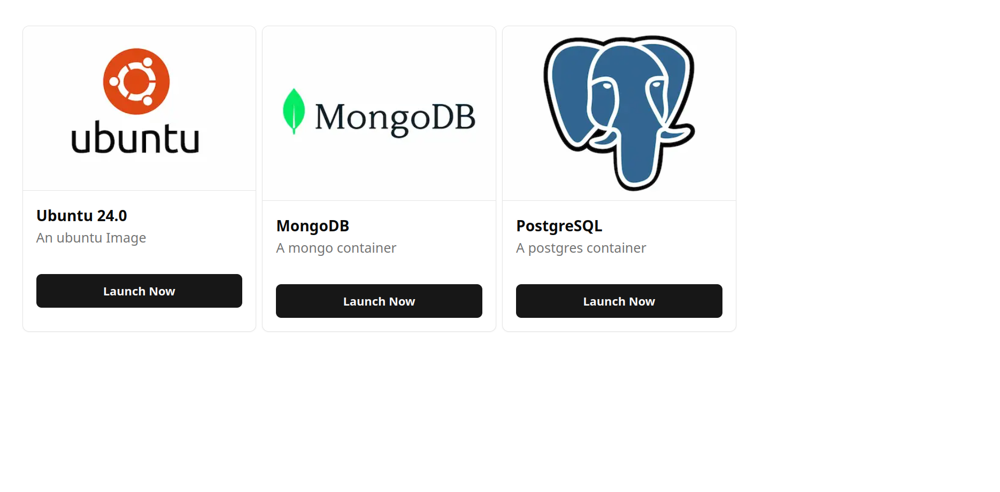

# Web Based Playgroud for Docker Containers


## How to setup the Project (installation):
1. Clone the repository.
2. Go to the Images directory and run the following commands:
    ```sh
    $ cd images/
    $ cd ubuntu-vscode-node/
    $ docker build -t ubuntu-vscode .
    ```
3. Go to the Server directory and run the following commands:
    ```sh
    $ cd server/
    $ npm install
    $ tsc
    $ node dist/
    ```
4. Go to the Web directory and run the following commands:
    ```sh
    $ cd web/
    $ npm install
    $ npm run dev
    ``` 
5. Open the browser and go to the following URL:
    ```
    http://localhost:3000/
    ```